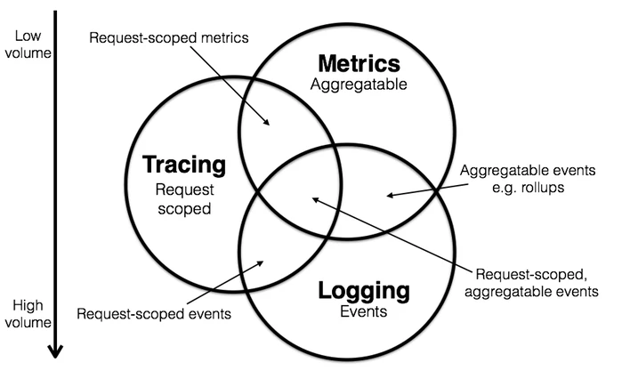
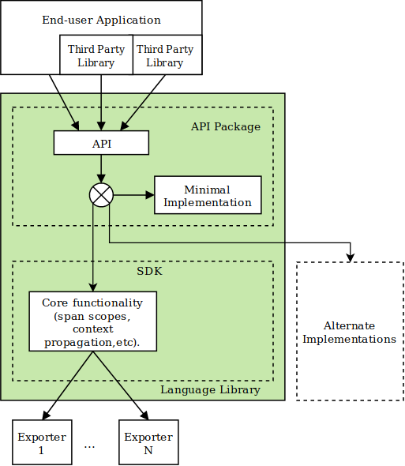
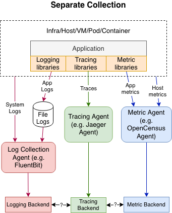
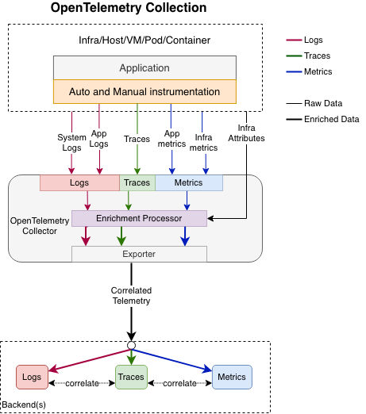
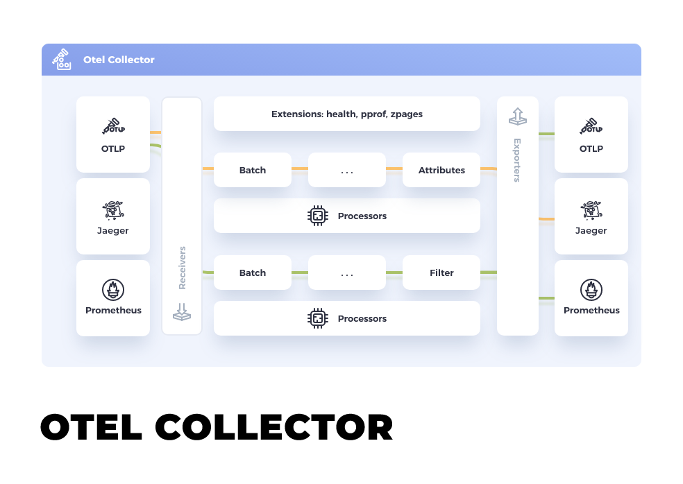
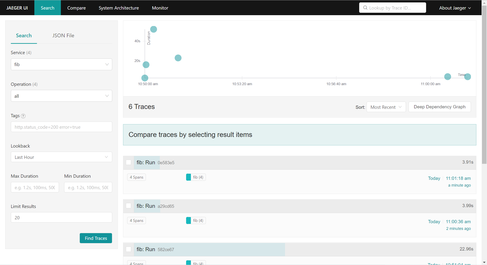
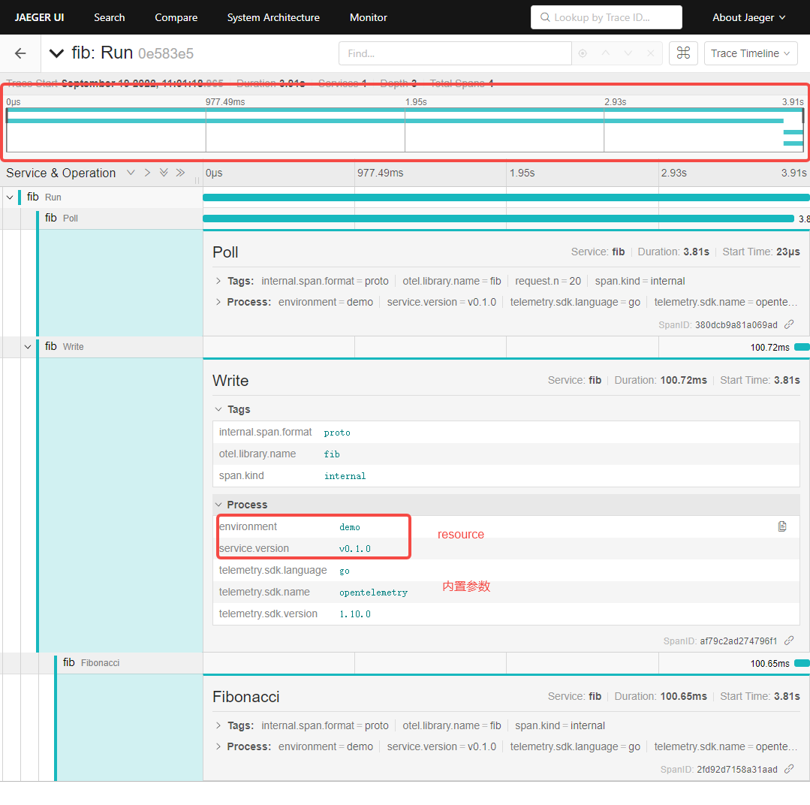
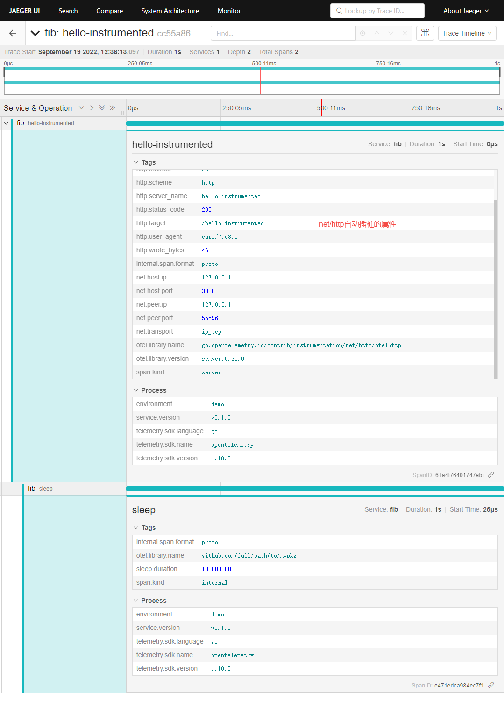
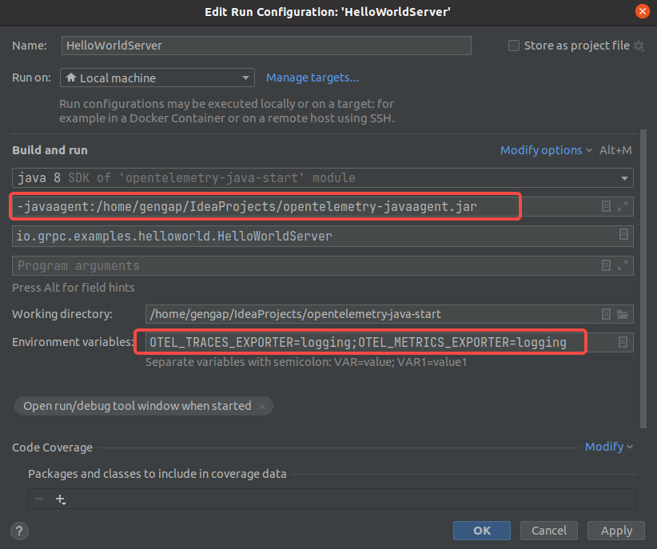
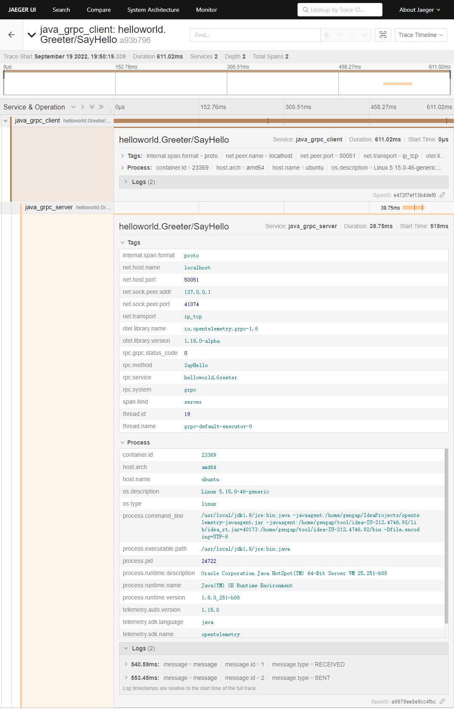

# 可观测性

Observability lets us understand a system from the outside, by letting us ask questions about that system without knowing its inner workings. 

如果能够在不发布新代码（如增加一个用于调试的日志）的情况下理解任何奇怪或不确定性的状态，那么我们的系统就具备可观测性。


我们先看看一个典型服务问题排查过程是怎样的：

- 通过各式各样预设报警发现异常（Metrics/Logs）
- 打开监控大盘查找异常现象，并通过查询找到异常模块（Metrics）
- 对异常模块以及关联日志进行查询分析，找到核心的报错信息（Logs）
- 通过详细的调用链数据定位到引起问题的代码（Tracing）

为了能够获得更好的可观测性或快速解决上述问题，Tracing、Metrics、Logs缺一不可。




与此同时，行业中已经有了丰富的开源及商业方案，其中包括：

- **Metric：**Zabbix、Nagios、Prometheus、InfluxDB、OpenFalcon、OpenCensus
- **Tracing：**Jaeger、Zipkin、SkyWalking、OpenTracing、OpenCensus
- **Logs：**ELK、Splunk、SumoLogic、Loki、Loggly。

各个方案也有着五花八门的协议格式/数据类型。不同的方案之间很难兼容/互通。与此同时，实际的业务场景中也会将各种方案混用，开发人员只能自己开发各类 Adapter 去兼容.

# Opentelemetry是什么？

OpenTracing制定了一套平台无关、厂商无关的协议标准，使得开发人员能够方便的添加或更换底层APM的实现。遵循OpenTracing协议的产品有Jaeger、Zipkin等等。

OpenCensus的最初目标为了把Go语言的Metrics采集、链路跟踪与Go语言自带的profile工具打通，统一用户的使用方式。

作为 CNCF 的孵化项目，OpenTelemetry 由 OpenTracing 和 OpenCensus 项目合并而成，是一组产商无关的SDK、API 接口、工具，可用来收集、转换、发送数据到开源或者商业的可观测性后端。同时为众多开发人员带来 Metrics、Tracing、Logs 的统一标准，三者都有相同的元数据结构，可以轻松实现互相关联。

## 能做啥？

- 每种语言都有产商无关的库来支持自动和手动的埋点
- 可支持多种部署方式，且与产商无关的二进制收集器
- 一个端到端实现产生，发射，收集，处理和导出telemetry数据
-  可通过配置将数据并行发送到多个目的地。  
- 开放标准语义约定，以确保供应商无关的数据收集  

## 不是啥？

OpenTelemetry 不是可观测性的后端，如Prometheus、Jaeger，不提供与可观测性相关的后端服务。可根据用户需求将可观测类数据导出到存储、查询、可视化等不同后端，如 Prometheus、Jaeger 、云厂商服务中。提供了可插拔的架构。

# Opentelemetry设计

cross-cutting concerns 横切关注点

## 整体架构


API：	API包由用于插桩的横切接口组成。导入第三方库和应用程序代码的OpenTelemetry客户端的任何部分都被视为API的一部分。

SDK：SDK是API的实现。在应用程序中，SDK由应用程序所有者安装和管理。注意，SDK包括额外的公共接口，这些接口不被认为是API包的一部分，因为它们不是横切关注点。这些公共接口被定义为构造函数和插件接口。应用程序所有者使用SDK构造函数;插件作者使用SDK插件接口。插桩作者绝对不能直接引用任何类型的SDK包，只能引用API。

Semantic Conventions：定义被应用使用的键和值，用于描述被观察的概念、协议和操作

- [Resource Conventions](https://opentelemetry.io/docs/reference/specification/resource/semantic_conventions/)
- [Span Conventions](https://opentelemetry.io/docs/reference/specification/trace/semantic_conventions/)
- [Metrics Conventions](https://opentelemetry.io/docs/reference/specification/metrics/semantic_conventions/)

Contrib packages：OpenTelemetry项目维护一些流行的OSS项目的集成，这些项目被认为对观察现代web服务非常重要。示例API集成包括用于web框架、数据库客户端和消息队列的插装。示例SDK集成包括将遥测数据导出到流行的分析工具和遥测数据存储系统的插件。

### Opentelemetry组件

参照：https://opentelemetry.io/docs/concepts/components/

OpenTelemetry目前由几个主要组件组成:

#### Specifcation-跨语言规范

描述所有实现的跨语言需求和期望。除了术语定义之外，该规范还定义了以下内容:

API:定义用于生成和关联tracing、metric和log数据的数据类型和操作。

SDK:为API的特定于语言的实现定义需求。这里还定义了配置、数据处理和导出概念。

Data:定义遥测后端可以提供支持的OpenTelemetry协议(OTLP)和供应商无关的语义约定。

#### Collector-收集、转换和导出遥测数据的工具

OpenTelemetry Collector是一个与供应商无关的代理，可以接收、处理和导出遥测数据。它支持以多种格式(如OTLP、Jaeger、Prometheus以及许多商业/专有工具)接收遥测数据，并将数据发送到一个或多个后端。它还支持在导出遥测数据之前处理和过滤数据。Collector contrib packages支持更多的数据格式和供应商后端。

#### Language SDKs-每种语言sdk

OpenTelemetry有各种语言sdk，可以根据所选语言的OpenTelemetry API的sdk生成遥测数据，并将数据导出到首选的后端。这些sdk还允许您为公共库和框架合并自动插桩，并使用这些库和框架连接到应用程序中的手动插桩。供应商经常制作语言sdk的分发版，以使导出到后端更简单。

#### Automatic Instrumentation-自动插桩和贡献包

OpenTelemetry支持大量从受支持语言的流行库和框架生成相关遥测数据的组件。例如，来自HTTP库的入站和出站HTTP请求将生成关于这些请求的数据。使用自动插装可能因语言而异，一种语言可能倾向于或要求使用随应用程序加载的组件，另一种语言可能倾向于在代码库中显式地拉入一个包。

将流行库编写成开箱即用的可观察对象是一个长期目标，这样就不需要引入单独的组件。

## 客户端设计

The SDK implementation should include the following exporters:

- logs, metrics, trace
  - OTLP (OpenTelemetry Protocol).
  - Standard output (or logging) to use for debugging and testing as well as an input for the various log proxy tools.
  - In-memory (mock) exporter that accumulates telemetry data in the local memory and allows to inspect it (useful for e.g. unit tests).
- metrics
  - Prometheus.
- trace
  - Jaeger.
  - Zipkin.



## collection设计








# Opentelemetry数据类型-Signals

从根本上来说，指标、日志和链路追踪只是数据类型，与可观测性无关。

## Trace

DAG

For example, the following is an example **Trace** made up of 6 **Spans**:

```text
Causal relationships between Spans in a single Trace

        [Span A]  ←←←(the root span)
            |
     +------+------+
     |             |
 [Span B]      [Span C] ←←←(Span C is a `child` of Span A)
     |             |
 [Span D]      +---+-------+
               |           |
           [Span E]    [Span F]
```

Sometimes it’s easier to visualize **Traces** with a time axis as in the diagram below:

```text
Temporal relationships between Spans in a single Trace

––|–––––––|–––––––|–––––––|–––––––|–––––––|–––––––|–––––––|–> time

 [Span A···················································]
   [Span B··········································]
      [Span D······································]
    [Span C····················································]
         [Span E·······]        [Span F··]
```


### Trace Context

We identify Span Context using four major components: a **`traceID`** and **`spanID`**, **Trace Flags**, and **Trace State**.

**`traceID`** - A unique 16-byte array to identify the trace that a span is associated with

**`spanID`** - Hex-encoded 8-byte array to identify the current span

**Trace Flags** - Provides more details about the trace, such as if it is sampled

**Trace State** - Provides more vendor-specific information for tracing across multiple distributed systems. Please refer to [W3C Trace Context](https://www.w3.org/TR/trace-context/#trace-flags) for further explanation.


### Span

```json
{
  "trace_id": "7bba9f33312b3dbb8b2c2c62bb7abe2d",
  "parent_id": "",
  "span_id": "086e83747d0e381e",
  "name": "/v1/sys/health",
  "start_time": "2021-10-22 16:04:01.209458162 +0000 UTC",
  "end_time": "2021-10-22 16:04:01.209514132 +0000 UTC",
  "status_code": "STATUS_CODE_OK",
  "status_message": "",
  "attributes": {
    "net.transport": "IP.TCP",
    "net.peer.ip": "172.17.0.1",
    "net.peer.port": "51820",
    "net.host.ip": "10.177.2.152",
    "net.host.port": "26040",
    "http.method": "GET",
    "http.target": "/v1/sys/health",
    "http.server_name": "mortar-gateway",
    "http.route": "/v1/sys/health",
    "http.user_agent": "Consul Health Check",
    "http.scheme": "http",
    "http.host": "10.177.2.152:26040",
    "http.flavor": "1.1"
  },
  "events": [
    {
      "name": "",
      "message": "OK",
      "timestamp": "2021-10-22 16:04:01.209512872 +0000 UTC"
    }
  ]
}
```

events打印一些日志，比如请求和响应体的内容；

links表示trace的关联，比如新启动一个异步的任务

## Metric

Metric 是关于一个服务的度量，在运行时捕获。从逻辑上讲，捕获其中一个量度的时刻称为 Metric event，它不仅包含量度本身，还包括获取它的时间和相关元数据。应用和请求指标是可用性和性能的重要指标。自定义指标可以深入了解可用性如何影响用户体验和业务。自定义 Metrics 可以深入理解可用性 Metrics 是如何影响用户体验或业务的。OpenTelemetry 目前定义了三个 Metric 工具：

- **counter:** 一个随时间求和的值，可以理解成汽车的里程表，它只会上升。
- **measure:** 随时间聚合的值。它表示某个定义范围内的值。
- **observer:** 捕捉特定时间点的一组当前值，如车辆中的燃油表。

https://opentelemetry.io/docs/reference/specification/metrics/datamodel/

## Log

日志是带有时间戳的文本记录，可以是带有元数据结构化的，也可以是非结构化的。虽然每个日志都是独立数据源，但可以附加到 Trace 的 Span 中。日常使用调用时，在进行节点分析时出伴随着也可看到日志。

https://opentelemetry.io/docs/reference/specification/logs/overview/#limitations-of-non-opentelemetry-solutions

## Baggage

OpenTelemetry 还提供了 Baggage 来传播键值对。Baggage 用于索引一个服务中的可观察事件，该服务包含同一事务中先前的服务提供的属性，有助于在事件之间建立因果关系。虽然 Baggage 可以用作其他横切关注点的原型，但这种机制主要是为了传递 OpenTelemetry 可观测性系统的值。这些值可以从 Baggage 中消费，并作为度量的附加维度，或日志和跟踪的附加上下文使用。

# Opentelemetry Collection

Collector提供了产商无关的数据接受、处理、导出的telemetry的数据能力，不需要运行多个Collector来支持多个开源的数据格式后端如prometheus和jaeger。

## 部署方式

提供了一个二进包两种部署方式

agent：与应用程序一起运行或与应用程序在同一主机上运行的Collector实例（二进制、sidecar、daemonset）

gateway：一个或多个Collector实例作为一个独立的服务(例如container or deployment)运行，通常为每个集群、数据中心或区域。

## Collection组件

收集器由以下组件组成:

receivers:如何将数据放入收集器;这些可以是推或拉的

processors:如何处理接收到的数据

exporters:将接收到的数据发送到哪里;这些可以是推或拉的

这些组件是通过pipeline启用的。可以通过YAML配置定义组件和管道的多个实例。

# Demo示例

代码：

https://github.com/open-telemetry/opentelemetry-collector-contrib/tree/main/examples/demo

架构


```shell
yum install docker
yum install docker-compose
git clone git@github.com:open-telemetry/opentelemetry-collector-contrib.git
cd examples/demo
docker-compose up -d #需要修改Dockerfile中的env变量为阿里的go镜像
```

访问地址

jaeger:  http://39.105.101.198:16686/

zipkin:  http://39.105.101.198:9411/

prometheus:  http://39.105.101.198:9090/

# go开发

Go不像其他语言那样支持真正的自动插桩。相反，您需要依赖特定的插桩库生成遥测数据的插桩库。例如，一旦您在代码中配置了net/http的插桩库，它将自动创建跟踪入站和出站请求的span。

| Tracing | Metrics | Logging             |
| ------- | ------- | ------------------- |
| Stable  | Alpha   | Not Yet Implemented |

metric属于alpha阶段

代码参照：https://github.com/genganpeng/opentelemetry-go-start.git

文档参照：https://opentelemetry.io/docs/instrumentation/go/getting-started/

## API定义遥测数据如何生成

设计到两个包：

```sh
go get go.opentelemetry.io/otel \
       go.opentelemetry.io/otel/trace
```

app.go

```go
package fib

import (
	"context"
	"fmt"
	"go.opentelemetry.io/otel"
	"go.opentelemetry.io/otel/attribute"
	"go.opentelemetry.io/otel/codes"
	"go.opentelemetry.io/otel/trace"
	"io"
	"log"
	"strconv"
)

// name is the Tracer name used to identify this instrumentation library.
// Using the full-qualified package name
const name = "fib"

// App is a Fibonacci computation application.
type App struct {
	r io.Reader
	l *log.Logger
}

// NewApp returns a new App.
func NewApp(r io.Reader, l *log.Logger) *App {
	return &App{r: r, l: l}
}

// Run starts polling users for Fibonacci number requests and writes results.
func (a *App) Run(ctx context.Context) error {
	for {
		// Each execution of the run loop, we should get a new "root" span and context.
		// The span is created using a Tracer from the global TracerProvider
		// In OpenTelemetry Go the span relationships are defined explicitly with a context.Context
		newCtx, span := otel.Tracer(name).Start(ctx, "Run")

		n, err := a.Poll(newCtx)
		if err != nil {
			span.End()
			return err
		}

		a.Write(newCtx, n)
		span.End()
	}
}

// Poll asks a user for input and returns the request.
func (a *App) Poll(ctx context.Context) (uint, error) {
	//Similar to the Run method instrumentation, this adds a span to the method to track the computation performed
	_, span := otel.Tracer(name).Start(ctx, "Poll")
	defer span.End()
	a.l.Print("What Fibonacci number would you like to know: ")

	var n uint
	_, err := fmt.Fscanf(a.r, "%d\n", &n)
	if err != nil {
		span.RecordError(err)
		span.SetStatus(codes.Error, err.Error())
		return 0, err
	}

	// Store n as a string to not overflow an int64.
	nStr := strconv.FormatUint(uint64(n), 10)
	// this attribute is something you can add when you think a user of your application will want to see the state or details about the run environment when looking at telemetry.
	span.SetAttributes(attribute.String("request.n", nStr))
	return n, err
}

// Write writes the n-th Fibonacci number back to the user.
func (a *App) Write(ctx context.Context, n uint) {
	// This method is instrumented with two spans. One to track the Write method itself, and another to track the call to the core logic with the Fibonacci function.
	var span trace.Span
	ctx, span = otel.Tracer(name).Start(ctx, "Write")
	defer span.End()

	f, err := func(ctx context.Context) (uint64, error) {
		_, span := otel.Tracer(name).Start(ctx, "Fibonacci")
		defer span.End()
		f, err := Fibonacci(n)
		// include errors returned to a user in the telemetry data
		if err != nil {
			span.RecordError(err)
			span.SetStatus(codes.Error, err.Error())
		}
		return f, nil
	}(ctx)

	if err != nil {
		a.l.Printf("Fibonacci(%d): %v\n", n, err)
	} else {
		a.l.Printf("Fibonacci(%d) = %d\n", n, f)
	}
}
```

## SDK安装

OpenTelemetry Go项目提供了一个SDK包， [`go.opentelemetry.io/otel/sdk`](https://pkg.go.dev/go.opentelemetry.io/otel/sdk). 它实现了API并遵循OpenTelemetry规范。

安装trace STDOUT导出器和SDK。

```sh
$ go get go.opentelemetry.io/otel/sdk \
         go.opentelemetry.io/otel/exporters/stdout/stdouttrace
```

- Creating a Console Exporter

- Creating a Resource

- Installing a Tracer Provider 


main.go

```go
package main

import (
	"context"
	"go.opentelemetry.io/otel"
	"go.opentelemetry.io/otel/attribute"
	"go.opentelemetry.io/otel/sdk/resource"
	"io"
	"log"
	fib "opentelemetry-fib/fib"
	"os"
	"os/signal"
	"syscall"

	"go.opentelemetry.io/otel/exporters/stdout/stdouttrace"
	"go.opentelemetry.io/otel/sdk/trace"
	semconv "go.opentelemetry.io/otel/semconv/v1.12.0"
)

func main() {
	l := log.New(os.Stdout, "", 0)

	// Write telemetry data to a file.
	f, err := os.Create("traces.yaml")
	if err != nil {
		l.Fatal(err)
	}

	exp, err := newExporter(f)
	if err != nil {
		l.Fatal(err)
	}

	// You have your application instrumented to produce telemetry data and you have an exporter to send that data to the console, but how are they connected?
	// The pipelines that receive and ultimately transmit data to exporters are called SpanProcessor
	// This is done with a BatchSpanProcessor when it is passed to the trace.WithBatcher option. Batching data is a good practice and will help not overload systems downstream.
	tp := trace.NewTracerProvider(
		trace.WithBatcher(exp), //configured to have multiple span processors
		trace.WithResource(newResource()),
	)
	// you are deferring a function to flush and stop it
	defer func() {
		if err := tp.Shutdown(context.Background()); err != nil {
			l.Fatal(err)
		}
	}()
	//registering it as the global OpenTelemetry TracerProvider.
	otel.SetTracerProvider(tp)

	sigCh := make(chan os.Signal, 1)
	signal.Notify(sigCh, syscall.SIGHUP, syscall.SIGINT, syscall.SIGQUIT, syscall.SIGTERM)

	errCh := make(chan error)
	app := fib.NewApp(os.Stdin, l)
	go func() {
		errCh <- app.Run(context.Background())
	}()

	select {
	case <-sigCh:
		l.Println("\ngoodbye")
		return
	case err := <-errCh:
		if err != nil {
			l.Fatal(err)
		}
	}
}

// newExporter returns a console exporter.
// The SDK connects telemetry from the OpenTelemetry API to exporters.
// Exporters are packages that allow telemetry data to be emitted somewhere - either to the console (which is what we’re doing here),
// or to a remote system or collector for further analysis and/or enrichment
// OpenTelemetry supports a variety of exporters through its ecosystem including popular open source tools like Jaeger, Zipkin, and Prometheus.
func newExporter(w io.Writer) (trace.SpanExporter, error) {
	return stdouttrace.New(
		stdouttrace.WithWriter(w),
		// Use human-readable output.
		stdouttrace.WithPrettyPrint(),
		// Do not print timestamps for the demo.
		stdouttrace.WithoutTimestamps(),
	)
}

// newResource returns a resource describing this application.
// The catch is, you need a way to identify what service, or even what service instance, that data is coming from.
// OpenTelemetry uses a Resource to represent the entity producing telemetry.
func newResource() *resource.Resource {
	r, _ := resource.Merge(
		resource.Default(),
		resource.NewWithAttributes(
			semconv.SchemaURL,
			semconv.ServiceNameKey.String("fib"),
			semconv.ServiceVersionKey.String("v0.1.0"),
			attribute.String("environment", "demo"),
		),
	)
	return r
}
```

上面的例子遥测数据导出到了traces.yaml中


## 其他部分代码

fib.go

```go
package fib

import "fmt"

// Fibonacci returns the n-th fibonacci number.
func Fibonacci(n uint) (uint64, error) {
	if n <= 1 {
		return uint64(n), nil
	}

	if n > 93 {
		return 0, fmt.Errorf("unsupported fibonacci number %d: too large", n)
	}

	var n2, n1 uint64 = 0, 1
	for i := uint(2); i < n; i++ {
		n2, n1 = n1, n1+n2
	}

	return n2 + n1, nil
}

```

go.mod

```go
module opentelemetry-fib

go 1.19

require (
	go.opentelemetry.io/otel v1.10.0
	go.opentelemetry.io/otel/exporters/otlp/otlptrace v1.10.0
	go.opentelemetry.io/otel/exporters/otlp/otlptrace/otlptracegrpc v1.10.0
	go.opentelemetry.io/otel/exporters/stdout/stdouttrace v1.10.0
	go.opentelemetry.io/otel/sdk v1.10.0
	go.opentelemetry.io/otel/trace v1.10.0
)

require (
	github.com/cenkalti/backoff/v4 v4.1.3 // indirect
	github.com/go-logr/logr v1.2.3 // indirect
	github.com/go-logr/stdr v1.2.2 // indirect
	github.com/golang/protobuf v1.5.2 // indirect
	github.com/grpc-ecosystem/grpc-gateway/v2 v2.7.0 // indirect
	go.opentelemetry.io/otel/exporters/otlp/internal/retry v1.10.0 // indirect
	go.opentelemetry.io/proto/otlp v0.19.0 // indirect
	golang.org/x/net v0.0.0-20210405180319-a5a99cb37ef4 // indirect
	golang.org/x/sys v0.0.0-20220915200043-7b5979e65e41 // indirect
	golang.org/x/text v0.3.5 // indirect
	google.golang.org/genproto v0.0.0-20211118181313-81c1377c94b1 // indirect
	google.golang.org/grpc v1.46.2 // indirect
	google.golang.org/protobuf v1.28.1 // indirect
)

```


## 导出遥测数据到Collector

main.go中修改如下

```go

	client := otlptracegrpc.NewClient()
	exporter, err := otlptrace.New(context.Background(), client)
	if err != nil {
		l.Fatal("creating OTLP trace exporter: %w", err)
	}


	// You have your application instrumented to produce telemetry data and you have an exporter to send that data to the console, but how are they connected?
	// The pipelines that receive and ultimately transmit data to exporters are called SpanProcessor
	// This is done with a BatchSpanProcessor when it is passed to the trace.WithBatcher option. Batching data is a good practice and will help not overload systems downstream.
	tp := trace.NewTracerProvider(
		trace.WithBatcher(exporter),
		trace.WithBatcher(exp), //configured to have multiple span processors
		trace.WithResource(newResource()),
	)
```

配置collector的地址，使用环境变量的方式。

`OTEL_EXPORTER_OTLP_ENDPOINT=http://39.105.101.198:4317`

注意：**上面使用的是grpc协议，对应的端口是4317**






## 使用插桩库

Go不像其他语言那样支持真正的自动检测。相反，您需要依赖为特定的插桩库生成遥测数据。例如，一旦您在代码中使用了net/http的插桩库，它将自动创建跟踪入站和出站请求的跨。

### 构建

```console
go get go.opentelemetry.io/contrib/instrumentation/{import-path}/otel{package-name}
```

### net/http例子

```console
go get go.opentelemetry.io/contrib/instrumentation/net/http/otelhttp
```

http.go

```go
package http

import (
	"context"
	"fmt"
	"log"
	"net/http"
	"time"

	"go.opentelemetry.io/contrib/instrumentation/net/http/otelhttp"
	"go.opentelemetry.io/otel"
	"go.opentelemetry.io/otel/attribute"
)

// Package-level tracer.
// This should be configured in your code setup instead of here.
var tracer = otel.Tracer("github.com/full/path/to/mypkg")

// sleepy mocks work that your application does.
func sleepy(ctx context.Context) {
	_, span := tracer.Start(ctx, "sleep")
	defer span.End()

	sleepTime := 1 * time.Second
	time.Sleep(sleepTime)
	span.SetAttributes(attribute.Int("sleep.duration", int(sleepTime)))
}

// httpHandler is an HTTP handler function that is going to be instrumented.
func httpHandler(w http.ResponseWriter, r *http.Request) {
	fmt.Fprintf(w, "Hello, World! I am instrumented automatically!")
	ctx := r.Context()
	sleepy(ctx)
}

func StartHttp()  {
	// Wrap your httpHandler function.
	handler := http.HandlerFunc(httpHandler)
	wrappedHandler := otelhttp.NewHandler(handler, "hello-instrumented")
	http.Handle("/hello-instrumented", wrappedHandler)

	// And start the HTTP serve.
	log.Fatal(http.ListenAndServe(":3030", nil))
}

```

修改main.go

```go
	errCh := make(chan error)
	app := fib.NewApp(os.Stdin, l)
	go func() {
		errCh <- app.Run(context.Background())
	}()

	//create http
	go func() {
		http.StartHttp()
	}()

	select {
	case <-sigCh:
		l.Println("\ngoodbye")
		return
	case err := <-errCh:
		if err != nil {
			l.Fatal(err)
		}
	}
```


请求： curl http://127.0.0.1:3030/hello-instrumented



将在应用程序中编写的手动插桩与库生成的插桩相连接，对于获得应用程序和服务的良好可观察性非常重要。

### 可用包

可用的工具库的完整列表可以在[OpenTelemetry registry](https://opentelemetry.io/registry/?language=go&component=instrumentation).

## 手动插桩

参见 https://opentelemetry.io/docs/instrumentation/go/manual/

## 导出数据

参见 https://opentelemetry.io/docs/instrumentation/go/exporting_data/

# Java开发

包含一下几个仓库

- [opentelemetry-java](https://github.com/open-telemetry/opentelemetry-java):用于人工插桩的组件，包括API和SDK以及扩展、OpenTracing垫片。

- [opentelemetry-java-docs](https://github.com/open-telemetry/opentelemetry-java-docs#java-opentelemetry-examples): 手工插装示例。

- [opentelemetry-java-instrumentation](https://github.com/open-telemetry/opentelemetry-java-instrumentation):构建在opentelemetry-java之上，提供了一个Java代理JAR，它可以附加到任何Java 8+应用程序，并动态地注入字节码，以从许多流行的库和框架捕获遥测。

- [opentelemetry-java-contrib](https://github.com/open-telemetry/opentelemetry-java-contrib):提供有用的库和独立的基于OpenTelemetry的实用程序，它们不适合OpenTelemetry Java或Java Instrumentation项目的明确范围。例如JMX的metric 收集

| Traces | Metrics | Logs         |
| ------ | ------- | ------------ |
| Stable | Stable  | Experimental |

建议使用BOM来保持不同组件的版本同步。

文档参考：https://opentelemetry.io/docs/instrumentation/java/getting-started/

grpc参考： https://grpc.io/docs/languages/java/quickstart/

代码参考：https://github.com/genganpeng/opentelemetry-java-start.git

## java grpc例子

pom.xml

```xml
<?xml version="1.0" encoding="UTF-8"?>
<project xmlns="http://maven.apache.org/POM/4.0.0"
         xmlns:xsi="http://www.w3.org/2001/XMLSchema-instance"
         xsi:schemaLocation="http://maven.apache.org/POM/4.0.0 http://maven.apache.org/xsd/maven-4.0.0.xsd">
    <modelVersion>4.0.0</modelVersion>

    <groupId>org.example</groupId>
    <artifactId>opentelemetry-java-start</artifactId>
    <version>1.0-SNAPSHOT</version>

    <properties>
        <project.build.sourceEncoding>UTF-8</project.build.sourceEncoding>
        <grpc.version>1.49.0</grpc.version><!-- CURRENT_GRPC_VERSION -->
        <protobuf.version>3.21.1</protobuf.version>
        <protoc.version>3.21.1</protoc.version>
        <!-- required for jdk9 -->
        <maven.compiler.source>1.8</maven.compiler.source>
        <maven.compiler.target>1.8</maven.compiler.target>
    </properties>

    <dependencyManagement>
        <dependencies>
            <dependency>
                <groupId>io.grpc</groupId>
                <artifactId>grpc-bom</artifactId>
                <version>${grpc.version}</version>
                <type>pom</type>
                <scope>import</scope>
            </dependency>
        </dependencies>
    </dependencyManagement>

    <dependencies>
        <dependency>
            <groupId>io.grpc</groupId>
            <artifactId>grpc-netty-shaded</artifactId>
            <scope>runtime</scope>
        </dependency>
        <dependency>
            <groupId>io.grpc</groupId>
            <artifactId>grpc-protobuf</artifactId>
        </dependency>
        <dependency>
            <groupId>io.grpc</groupId>
            <artifactId>grpc-stub</artifactId>
        </dependency>
        <dependency>
            <groupId>com.google.protobuf</groupId>
            <artifactId>protobuf-java-util</artifactId>
            <version>${protobuf.version}</version>
        </dependency>
        <dependency>
            <groupId>com.google.code.gson</groupId>
            <artifactId>gson</artifactId>
            <version>2.9.0</version> <!-- prevent downgrade via protobuf-java-util -->
        </dependency>
        <dependency>
            <groupId>org.apache.tomcat</groupId>
            <artifactId>annotations-api</artifactId>
            <version>6.0.53</version>
            <scope>provided</scope> <!-- not needed at runtime -->
        </dependency>
    <dependency>
        <groupId>io.grpc</groupId>
        <artifactId>grpc-testing</artifactId>
        <scope>test</scope>
    </dependency>
    <dependency>
        <groupId>junit</groupId>
        <artifactId>junit</artifactId>
        <version>4.12</version>
        <scope>test</scope>
    </dependency>
    <dependency>
        <groupId>org.mockito</groupId>
        <artifactId>mockito-core</artifactId>
        <version>3.4.0</version>
        <scope>test</scope>
    </dependency>
</dependencies>

<build>
<extensions>
    <extension>
        <groupId>kr.motd.maven</groupId>
        <artifactId>os-maven-plugin</artifactId>
        <version>1.6.2</version>
    </extension>
</extensions>
<plugins>
    <plugin>
        <groupId>org.xolstice.maven.plugins</groupId>
        <artifactId>protobuf-maven-plugin</artifactId>
        <version>0.6.1</version>
        <configuration>
            <protocArtifact>com.google.protobuf:protoc:${protoc.version}:exe:${os.detected.classifier}</protocArtifact>
            <pluginId>grpc-java</pluginId>
            <pluginArtifact>io.grpc:protoc-gen-grpc-java:${grpc.version}:exe:${os.detected.classifier}</pluginArtifact>
        </configuration>
        <executions>
            <execution>
                <goals>
                    <goal>compile</goal>
                    <goal>compile-custom</goal>
                </goals>
            </execution>
        </executions>
    </plugin>
    <plugin>
        <groupId>org.apache.maven.plugins</groupId>
        <artifactId>maven-enforcer-plugin</artifactId>
        <version>1.4.1</version>
        <executions>
            <execution>
                <id>enforce</id>
                <goals>
                    <goal>enforce</goal>
                </goals>
                <configuration>
                    <rules>
                        <requireUpperBoundDeps/>
                    </rules>
                </configuration>
            </execution>
        </executions>
    </plugin>
</plugins>
</build>
</project>
```

HelloWorldClient.java

```java
package io.grpc.examples.helloworld;/*
 * Copyright 2015 The gRPC Authors
 *
 * Licensed under the Apache License, Version 2.0 (the "License");
 * you may not use this file except in compliance with the License.
 * You may obtain a copy of the License at
 *
 *     http://www.apache.org/licenses/LICENSE-2.0
 *
 * Unless required by applicable law or agreed to in writing, software
 * distributed under the License is distributed on an "AS IS" BASIS,
 * WITHOUT WARRANTIES OR CONDITIONS OF ANY KIND, either express or implied.
 * See the License for the specific language governing permissions and
 * limitations under the License.
 */

import io.grpc.Channel;
import io.grpc.ManagedChannel;
import io.grpc.ManagedChannelBuilder;
import io.grpc.StatusRuntimeException;
import java.util.concurrent.TimeUnit;
import java.util.logging.Level;
import java.util.logging.Logger;

/**
 * A simple client that requests a greeting from the {@link HelloWorldServer}.
 */
public class HelloWorldClient {
  private static final Logger logger = Logger.getLogger(HelloWorldClient.class.getName());

  private final GreeterGrpc.GreeterBlockingStub blockingStub;

  /** Construct client for accessing HelloWorld server using the existing channel. */
  public HelloWorldClient(Channel channel) {
    // 'channel' here is a Channel, not a ManagedChannel, so it is not this code's responsibility to
    // shut it down.

    // Passing Channels to code makes code easier to test and makes it easier to reuse Channels.
    blockingStub = GreeterGrpc.newBlockingStub(channel);
  }

  /** Say hello to server. */
  public void greet(String name) {
    logger.info("Will try to greet " + name + " ...");
    HelloRequest request = HelloRequest.newBuilder().setName(name).build();
    HelloReply response;
    try {
      response = blockingStub.sayHello(request);
    } catch (StatusRuntimeException e) {
      logger.log(Level.WARNING, "RPC failed: {0}", e.getStatus());
      return;
    }
    logger.info("Greeting: " + response.getMessage());
  }

  /**
   * Greet server. If provided, the first element of {@code args} is the name to use in the
   * greeting. The second argument is the target server.
   */
  public static void main(String[] args) throws Exception {
    String user = "world";
    // Access a service running on the local machine on port 50051
    String target = "localhost:50051";
    // Allow passing in the user and target strings as command line arguments
    if (args.length > 0) {
      if ("--help".equals(args[0])) {
        System.err.println("Usage: [name [target]]");
        System.err.println("");
        System.err.println("  name    The name you wish to be greeted by. Defaults to " + user);
        System.err.println("  target  The server to connect to. Defaults to " + target);
        System.exit(1);
      }
      user = args[0];
    }
    if (args.length > 1) {
      target = args[1];
    }

    // Create a communication channel to the server, known as a Channel. Channels are thread-safe
    // and reusable. It is common to create channels at the beginning of your application and reuse
    // them until the application shuts down.
    ManagedChannel channel = ManagedChannelBuilder.forTarget(target)
        // Channels are secure by default (via SSL/TLS). For the example we disable TLS to avoid
        // needing certificates.
        .usePlaintext()
        .build();
    try {
      HelloWorldClient client = new HelloWorldClient(channel);
      client.greet(user);
    } finally {
      // ManagedChannels use resources like threads and TCP connections. To prevent leaking these
      // resources the channel should be shut down when it will no longer be used. If it may be used
      // again leave it running.
      channel.shutdownNow().awaitTermination(5, TimeUnit.SECONDS);
    }
  }
}

```

HelloWorldServer.go

```java
package io.grpc.examples.helloworld;/*
 * Copyright 2015 The gRPC Authors
 *
 * Licensed under the Apache License, Version 2.0 (the "License");
 * you may not use this file except in compliance with the License.
 * You may obtain a copy of the License at
 *
 *     http://www.apache.org/licenses/LICENSE-2.0
 *
 * Unless required by applicable law or agreed to in writing, software
 * distributed under the License is distributed on an "AS IS" BASIS,
 * WITHOUT WARRANTIES OR CONDITIONS OF ANY KIND, either express or implied.
 * See the License for the specific language governing permissions and
 * limitations under the License.
 */

import io.grpc.Server;
import io.grpc.ServerBuilder;
import io.grpc.stub.StreamObserver;
import java.io.IOException;
import java.util.concurrent.TimeUnit;
import java.util.logging.Logger;

/**
 * Server that manages startup/shutdown of a {@code Greeter} server.
 */
public class HelloWorldServer {
  private static final Logger logger = Logger.getLogger(HelloWorldServer.class.getName());

  private Server server;

  private void start() throws IOException {
    /* The port on which the server should run */
    int port = 50051;
    server = ServerBuilder.forPort(port)
        .addService(new GreeterImpl())
        .build()
        .start();
    logger.info("Server started, listening on " + port);
    Runtime.getRuntime().addShutdownHook(new Thread() {
      @Override
      public void run() {
        // Use stderr here since the logger may have been reset by its JVM shutdown hook.
        System.err.println("*** shutting down gRPC server since JVM is shutting down");
        try {
          HelloWorldServer.this.stop();
        } catch (InterruptedException e) {
          e.printStackTrace(System.err);
        }
        System.err.println("*** server shut down");
      }
    });
  }

  private void stop() throws InterruptedException {
    if (server != null) {
      server.shutdown().awaitTermination(30, TimeUnit.SECONDS);
    }
  }

  /**
   * Await termination on the main thread since the grpc library uses daemon threads.
   */
  private void blockUntilShutdown() throws InterruptedException {
    if (server != null) {
      server.awaitTermination();
    }
  }

  /**
   * Main launches the server from the command line.
   */
  public static void main(String[] args) throws IOException, InterruptedException {
    final HelloWorldServer server = new HelloWorldServer();
    server.start();
    server.blockUntilShutdown();
  }

  static class GreeterImpl extends GreeterGrpc.GreeterImplBase {

    @Override
    public void sayHello(HelloRequest req, StreamObserver<HelloReply> responseObserver) {
      HelloReply reply = HelloReply.newBuilder().setMessage("Hello " + req.getName()).build();
      responseObserver.onNext(reply);
      responseObserver.onCompleted();
    }
  }
}

```

helloworld.proto

```protobuf
// Copyright 2015 The gRPC Authors
//
// Licensed under the Apache License, Version 2.0 (the "License");
// you may not use this file except in compliance with the License.
// You may obtain a copy of the License at
//
//     http://www.apache.org/licenses/LICENSE-2.0
//
// Unless required by applicable law or agreed to in writing, software
// distributed under the License is distributed on an "AS IS" BASIS,
// WITHOUT WARRANTIES OR CONDITIONS OF ANY KIND, either express or implied.
// See the License for the specific language governing permissions and
// limitations under the License.
syntax = "proto3";

option java_multiple_files = true;
option java_package = "io.grpc.examples.helloworld";
option java_outer_classname = "HelloWorldProto";
option objc_class_prefix = "HLW";

package helloworld;

// The greeting service definition.
service Greeter {
  // Sends a greeting
  rpc SayHello (HelloRequest) returns (HelloReply) {}
}

// The request message containing the user's name.
message HelloRequest {
  string name = 1;
}

// The response message containing the greetings
message HelloReply {
  string message = 1;
}

```

运行客户端和服务器端：client output “Hello world”.

## 代码插桩

### 下载

Download [opentelemetry-javaagent.jar](https://github.com/open-telemetry/opentelemetry-java-instrumentation/releases/latest/download/opentelemetry-javaagent.jar) from [Releases](https://github.com/open-telemetry/opentelemetry-java-instrumentation/releases)

jar包中包含了agent和所有自动插桩的代码

### 配置插桩

使用适合您的shell/终端环境的表示法，设置和导出指定Java代理JAR和控制台trace导出器的环境变量

```shell
$ export JAVA_OPTS="-javaagent:/home/gengap/IdeaProjects/opentelemetry-javaagent.jar"
```

#### 导出到控制台

```shell
$ export OTEL_TRACES_EXPORTER=logging
$ export OTEL_METRICS_EXPORTER=logging	
```




idea配置如上

启动server和client，我们就看打印的trace和metrics

client输出的日志

```text
[otel.javaagent 2022-09-19 19:40:45:169 +0800] [main] INFO io.opentelemetry.javaagent.tooling.VersionLogger - opentelemetry-javaagent - version: 1.18.0
Sep 19, 2022 7:40:49 PM io.grpc.examples.helloworld.HelloWorldClient greet
INFO: Will try to greet world ...
[otel.javaagent 2022-09-19 19:40:50:267 +0800] [main] INFO io.opentelemetry.exporter.logging.LoggingSpanExporter - 'helloworld.Greeter/SayHello' : e9fd0c33274493eea3552b358bf51d09 e9746e28dc85de63 CLIENT [tracer: io.opentelemetry.grpc-1.6:1.18.0-alpha] AttributesMap{data={rpc.system=grpc, thread.name=main, net.peer.port=50051, rpc.service=helloworld.Greeter, rpc.grpc.status_code=0, rpc.method=SayHello, net.transport=ip_tcp, net.peer.name=localhost, thread.id=1}, capacity=128, totalAddedValues=9}
Sep 19, 2022 7:40:50 PM io.grpc.examples.helloworld.HelloWorldClient greet
INFO: Greeting: Hello world
[otel.javaagent 2022-09-19 19:40:50:323 +0800] [Thread-0] INFO io.opentelemetry.exporter.logging.LoggingMetricExporter - Received a collection of 15 metrics for export.
[otel.javaagent 2022-09-19 19:40:50:324 +0800] [Thread-0] INFO io.opentelemetry.exporter.logging.LoggingMetricExporter - metric: ImmutableMetricData{resource=Resource{schemaUrl=https://opentelemetry.io/schemas/1.12.0, attributes={container.id="23369", host.arch="amd64", host.name="ubuntu", os.description="Linux 5.15.0-46-generic", os.type="linux", process.command_line="/usr/local/jdk1.8/jre:bin:java -javaagent:/home/gengap/IdeaProjects/opentelemetry-javaagent.jar -javaagent:/home/gengap/tool/idea-IU-212.4746.92/lib/idea_rt.jar=41837:/home/gengap/tool/idea-IU-212.4746.92/bin -Dfile.encoding=UTF-8", process.executable.path="/usr/local/jdk1.8/jre:bin:java", process.pid=24459, process.runtime.description="Oracle Corporation Java HotSpot(TM) 64-Bit Server VM 25.251-b08", process.runtime.name="Java(TM) SE Runtime Environment", process.runtime.version="1.8.0_251-b08", service.name="unknown_service:java", telemetry.auto.version="1.18.0", telemetry.sdk.language="java", telemetry.sdk.name="opentelemetry", telemetry.sdk.version="1.18.0"}}, instrumentationScopeInfo=InstrumentationScopeInfo{name=io.opentelemetry.grpc-1.6, version=1.18.0-alpha, schemaUrl=null, attributes={}}, name=rpc.client.duration, description=The duration of an outbound RPC invocation, unit=ms, type=HISTOGRAM, data=ImmutableHistogramData{aggregationTemporality=CUMULATIVE, points=[ImmutableHistogramPointData{getStartEpochNanos=1663587645296000000, getEpochNanos=1663587650307000000, getAttributes={net.peer.name="localhost", net.peer.port=50051, net.transport="ip_tcp", rpc.grpc.status_code=0, rpc.method="SayHello", rpc.service="helloworld.Greeter", rpc.system="grpc"}, getSum=641.196486, getCount=1, hasMin=true, getMin=641.196486, hasMax=true, getMax=641.196486, getBoundaries=[5.0, 10.0, 25.0, 50.0, 75.0, 100.0, 250.0, 500.0, 750.0, 1000.0, 2500.0, 5000.0, 7500.0, 10000.0], getCounts=[0, 0, 0, 0, 0, 0, 0, 0, 1, 0, 0, 0, 0, 0, 0], getExemplars=[ImmutableDoubleExemplarData{filteredAttributes={}, epochNanos=1663587650267000000, spanContext=ImmutableSpanContext{traceId=e9fd0c33274493eea3552b358bf51d09, spanId=e9746e28dc85de63, traceFlags=01, traceState=ArrayBasedTraceState{entries=[]}, remote=false, valid=true}, value=641.196486}]}]}}
[otel.javaagent 2022-09-19 19:40:50:324 +0800] [Thread-0] INFO io.opentelemetry.exporter.logging.LoggingMetricExporter - metric: ImmutableMetricData{resource=Resource{schemaUrl=https://opentelemetry.io/schemas/1.12.0, attributes={container.id="23369", host.arch="amd64", host.name="ubuntu", os.description="Linux 5.15.0-46-generic", os.type="linux", process.command_line="/usr/local/jdk1.8/jre:bin:java -javaagent:/home/gengap/IdeaProjects/opentelemetry-javaagent.jar -javaagent:/home/gengap/tool/idea-IU-212.4746.92/lib/idea_rt.jar=41837:/home/gengap/tool/idea-IU-212.4746.92/bin -Dfile.encoding=UTF-8", process.executable.path="/usr/local/jdk1.8/jre:bin:java", process.pid=24459, process.runtime.description="Oracle Corporation Java HotSpot(TM) 64-Bit Server VM 25.251-b08", process.runtime.name="Java(TM) SE Runtime Environment", process.runtime.version="1.8.0_251-b08", service.name="unknown_service:java", telemetry.auto.version="1.18.0", telemetry.sdk.language="java", telemetry.sdk.name="opentelemetry", telemetry.sdk.version="1.18.0"}}, instrumentationScopeInfo=InstrumentationScopeInfo{name=io.opentelemetry.runtime-metrics, version=null, schemaUrl=null, attributes={}}, name=process.runtime.jvm.classes.unloaded, description=Number of classes unloaded since JVM start, unit=1, type=LONG_SUM, data=ImmutableSumData{points=[ImmutableLongPointData{startEpochNanos=1663587645296000000, epochNanos=1663587650307000000, attributes={}, value=0, exemplars=[]}], monotonic=true, aggregationTemporality=CUMULATIVE}}
[otel.javaagent 2022-09-19 19:40:50:324 +0800] [Thread-0] INFO io.opentelemetry.exporter.logging.LoggingMetricExporter - metric: ImmutableMetricData{resource=Resource{schemaUrl=https://opentelemetry.io/schemas/1.12.0, attributes={container.id="23369", host.arch="amd64", host.name="ubuntu", os.description="Linux 5.15.0-46-generic", os.type="linux", process.command_line="/usr/local/jdk1.8/jre:bin:java -javaagent:/home/gengap/IdeaProjects/opentelemetry-javaagent.jar -javaagent:/home/gengap/tool/idea-IU-212.4746.92/lib/idea_rt.jar=41837:/home/gengap/tool/idea-IU-212.4746.92/bin -Dfile.encoding=UTF-8", process.executable.path="/usr/local/jdk1.8/jre:bin:java", process.pid=24459, process.runtime.description="Oracle Corporation Java HotSpot(TM) 64-Bit Server VM 25.251-b08", process.runtime.name="Java(TM) SE Runtime Environment", process.runtime.version="1.8.0_251-b08", service.name="unknown_service:java", telemetry.auto.version="1.18.0", telemetry.sdk.language="java", telemetry.sdk.name="opentelemetry", telemetry.sdk.version="1.18.0"}}, instrumentationScopeInfo=InstrumentationScopeInfo{name=io.opentelemetry.runtime-metrics, version=null, schemaUrl=null, attributes={}}, name=process.runtime.jvm.buffer.count, description=The number of buffers in the pool, unit=buffers, type=LONG_SUM, data=ImmutableSumData{points=[ImmutableLongPointData{startEpochNanos=1663587645296000000, epochNanos=1663587650307000000, attributes={pool="mapped"}, value=0, exemplars=[]}, ImmutableLongPointData{startEpochNanos=1663587645296000000, epochNanos=1663587650307000000, attributes={pool="direct"}, value=11, exemplars=[]}], monotonic=false, aggregationTemporality=CUMULATIVE}}
[otel.javaagent 2022-09-19 19:40:50:325 +0800] [Thread-0] INFO io.opentelemetry.exporter.logging.LoggingMetricExporter - metric: ImmutableMetricData{resource=Resource{schemaUrl=https://opentelemetry.io/schemas/1.12.0, attributes={container.id="23369", host.arch="amd64", host.name="ubuntu", os.description="Linux 5.15.0-46-generic", os.type="linux", process.command_line="/usr/local/jdk1.8/jre:bin:java -javaagent:/home/gengap/IdeaProjects/opentelemetry-javaagent.jar -javaagent:/home/gengap/tool/idea-IU-212.4746.92/lib/idea_rt.jar=41837:/home/gengap/tool/idea-IU-212.4746.92/bin -Dfile.encoding=UTF-8", process.executable.path="/usr/local/jdk1.8/jre:bin:java", process.pid=24459, process.runtime.description="Oracle Corporation Java HotSpot(TM) 64-Bit Server VM 25.251-b08", process.runtime.name="Java(TM) SE Runtime Environment", process.runtime.version="1.8.0_251-b08", service.name="unknown_service:java", telemetry.auto.version="1.18.0", telemetry.sdk.language="java", telemetry.sdk.name="opentelemetry", telemetry.sdk.version="1.18.0"}}, instrumentationScopeInfo=InstrumentationScopeInfo{name=io.opentelemetry.runtime-metrics, version=null, schemaUrl=null, attributes={}}, name=process.runtime.jvm.classes.current_loaded, description=Number of classes currently loaded, unit=1, type=LONG_SUM, data=ImmutableSumData{points=[ImmutableLongPointData{startEpochNanos=1663587645296000000, epochNanos=1663587650307000000, attributes={}, value=5686, exemplars=[]}], monotonic=false, aggregationTemporality=CUMULATIVE}}
[otel.javaagent 2022-09-19 19:40:50:325 +0800] [Thread-0] INFO io.opentelemetry.exporter.logging.LoggingMetricExporter - metric: ImmutableMetricData{resource=Resource{schemaUrl=https://opentelemetry.io/schemas/1.12.0, attributes={container.id="23369", host.arch="amd64", host.name="ubuntu", os.description="Linux 5.15.0-46-generic", os.type="linux", process.command_line="/usr/local/jdk1.8/jre:bin:java -javaagent:/home/gengap/IdeaProjects/opentelemetry-javaagent.jar -javaagent:/home/gengap/tool/idea-IU-212.4746.92/lib/idea_rt.jar=41837:/home/gengap/tool/idea-IU-212.4746.92/bin -Dfile.encoding=UTF-8", process.executable.path="/usr/local/jdk1.8/jre:bin:java", process.pid=24459, process.runtime.description="Oracle Corporation Java HotSpot(TM) 64-Bit Server VM 25.251-b08", process.runtime.name="Java(TM) SE Runtime Environment", process.runtime.version="1.8.0_251-b08", service.name="unknown_service:java", telemetry.auto.version="1.18.0", telemetry.sdk.language="java", telemetry.sdk.name="opentelemetry", telemetry.sdk.version="1.18.0"}}, instrumentationScopeInfo=InstrumentationScopeInfo{name=io.opentelemetry.runtime-metrics, version=null, schemaUrl=null, attributes={}}, name=process.runtime.jvm.memory.limit, description=Measure of max obtainable memory, unit=By, type=LONG_SUM, data=ImmutableSumData{points=[ImmutableLongPointData{startEpochNanos=1663587645296000000, epochNanos=1663587650307000000, attributes={pool="PS Old Gen", type="heap"}, value=1384120320, exemplars=[]}, ImmutableLongPointData{startEpochNanos=1663587645296000000, epochNanos=1663587650307000000, attributes={pool="PS Survivor Space", type="heap"}, value=9437184, exemplars=[]}, ImmutableLongPointData{startEpochNanos=1663587645296000000, epochNanos=1663587650307000000, attributes={pool="PS Eden Space", type="heap"}, value=672661504, exemplars=[]}, ImmutableLongPointData{startEpochNanos=1663587645296000000, epochNanos=1663587650307000000, attributes={pool="Code Cache", type="non_heap"}, value=251658240, exemplars=[]}, ImmutableLongPointData{startEpochNanos=1663587645296000000, epochNanos=1663587650307000000, attributes={pool="Compressed Class Space", type="non_heap"}, value=1073741824, exemplars=[]}], monotonic=false, aggregationTemporality=CUMULATIVE}}
[otel.javaagent 2022-09-19 19:40:50:325 +0800] [Thread-0] INFO io.opentelemetry.exporter.logging.LoggingMetricExporter - metric: ImmutableMetricData{resource=Resource{schemaUrl=https://opentelemetry.io/schemas/1.12.0, attributes={container.id="23369", host.arch="amd64", host.name="ubuntu", os.description="Linux 5.15.0-46-generic", os.type="linux", process.command_line="/usr/local/jdk1.8/jre:bin:java -javaagent:/home/gengap/IdeaProjects/opentelemetry-javaagent.jar -javaagent:/home/gengap/tool/idea-IU-212.4746.92/lib/idea_rt.jar=41837:/home/gengap/tool/idea-IU-212.4746.92/bin -Dfile.encoding=UTF-8", process.executable.path="/usr/local/jdk1.8/jre:bin:java", process.pid=24459, process.runtime.description="Oracle Corporation Java HotSpot(TM) 64-Bit Server VM 25.251-b08", process.runtime.name="Java(TM) SE Runtime Environment", process.runtime.version="1.8.0_251-b08", service.name="unknown_service:java", telemetry.auto.version="1.18.0", telemetry.sdk.language="java", telemetry.sdk.name="opentelemetry", telemetry.sdk.version="1.18.0"}}, instrumentationScopeInfo=InstrumentationScopeInfo{name=io.opentelemetry.runtime-metrics, version=null, schemaUrl=null, attributes={}}, name=process.runtime.jvm.buffer.limit, description=Total capacity of the buffers in this pool, unit=By, type=LONG_SUM, data=ImmutableSumData{points=[ImmutableLongPointData{startEpochNanos=1663587645296000000, epochNanos=1663587650307000000, attributes={pool="mapped"}, value=0, exemplars=[]}, ImmutableLongPointData{startEpochNanos=1663587645296000000, epochNanos=1663587650307000000, attributes={pool="direct"}, value=417792, exemplars=[]}], monotonic=false, aggregationTemporality=CUMULATIVE}}
[otel.javaagent 2022-09-19 19:40:50:325 +0800] [Thread-0] INFO io.opentelemetry.exporter.logging.LoggingMetricExporter - metric: ImmutableMetricData{resource=Resource{schemaUrl=https://opentelemetry.io/schemas/1.12.0, attributes={container.id="23369", host.arch="amd64", host.name="ubuntu", os.description="Linux 5.15.0-46-generic", os.type="linux", process.command_line="/usr/local/jdk1.8/jre:bin:java -javaagent:/home/gengap/IdeaProjects/opentelemetry-javaagent.jar -javaagent:/home/gengap/tool/idea-IU-212.4746.92/lib/idea_rt.jar=41837:/home/gengap/tool/idea-IU-212.4746.92/bin -Dfile.encoding=UTF-8", process.executable.path="/usr/local/jdk1.8/jre:bin:java", process.pid=24459, process.runtime.description="Oracle Corporation Java HotSpot(TM) 64-Bit Server VM 25.251-b08", process.runtime.name="Java(TM) SE Runtime Environment", process.runtime.version="1.8.0_251-b08", service.name="unknown_service:java", telemetry.auto.version="1.18.0", telemetry.sdk.language="java", telemetry.sdk.name="opentelemetry", telemetry.sdk.version="1.18.0"}}, instrumentationScopeInfo=InstrumentationScopeInfo{name=io.opentelemetry.runtime-metrics, version=null, schemaUrl=null, attributes={}}, name=process.runtime.jvm.memory.committed, description=Measure of memory committed, unit=By, type=LONG_SUM, data=ImmutableSumData{points=[ImmutableLongPointData{startEpochNanos=1663587645296000000, epochNanos=1663587650307000000, attributes={pool="PS Old Gen", type="heap"}, value=55050240, exemplars=[]}, ImmutableLongPointData{startEpochNanos=1663587645296000000, epochNanos=1663587650307000000, attributes={pool="PS Survivor Space", type="heap"}, value=9437184, exemplars=[]}, ImmutableLongPointData{startEpochNanos=1663587645296000000, epochNanos=1663587650307000000, attributes={pool="Metaspace", type="non_heap"}, value=30277632, exemplars=[]}, ImmutableLongPointData{startEpochNanos=1663587645296000000, epochNanos=1663587650307000000, attributes={pool="PS Eden Space", type="heap"}, value=82313216, exemplars=[]}, ImmutableLongPointData{startEpochNanos=1663587645296000000, epochNanos=1663587650307000000, attributes={pool="Code Cache", type="non_heap"}, value=8978432, exemplars=[]}, ImmutableLongPointData{startEpochNanos=1663587645296000000, epochNanos=1663587650307000000, attributes={pool="Compressed Class Space", type="non_heap"}, value=4325376, exemplars=[]}], monotonic=false, aggregationTemporality=CUMULATIVE}}
[otel.javaagent 2022-09-19 19:40:50:325 +0800] [Thread-0] INFO io.opentelemetry.exporter.logging.LoggingMetricExporter - metric: ImmutableMetricData{resource=Resource{schemaUrl=https://opentelemetry.io/schemas/1.12.0, attributes={container.id="23369", host.arch="amd64", host.name="ubuntu", os.description="Linux 5.15.0-46-generic", os.type="linux", process.command_line="/usr/local/jdk1.8/jre:bin:java -javaagent:/home/gengap/IdeaProjects/opentelemetry-javaagent.jar -javaagent:/home/gengap/tool/idea-IU-212.4746.92/lib/idea_rt.jar=41837:/home/gengap/tool/idea-IU-212.4746.92/bin -Dfile.encoding=UTF-8", process.executable.path="/usr/local/jdk1.8/jre:bin:java", process.pid=24459, process.runtime.description="Oracle Corporation Java HotSpot(TM) 64-Bit Server VM 25.251-b08", process.runtime.name="Java(TM) SE Runtime Environment", process.runtime.version="1.8.0_251-b08", service.name="unknown_service:java", telemetry.auto.version="1.18.0", telemetry.sdk.language="java", telemetry.sdk.name="opentelemetry", telemetry.sdk.version="1.18.0"}}, instrumentationScopeInfo=InstrumentationScopeInfo{name=io.opentelemetry.runtime-metrics, version=null, schemaUrl=null, attributes={}}, name=process.runtime.jvm.memory.usage, description=Measure of memory used, unit=By, type=LONG_SUM, data=ImmutableSumData{points=[ImmutableLongPointData{startEpochNanos=1663587645296000000, epochNanos=1663587650307000000, attributes={pool="PS Old Gen", type="heap"}, value=11267024, exemplars=[]}, ImmutableLongPointData{startEpochNanos=1663587645296000000, epochNanos=1663587650307000000, attributes={pool="PS Survivor Space", type="heap"}, value=5128632, exemplars=[]}, ImmutableLongPointData{startEpochNanos=1663587645296000000, epochNanos=1663587650307000000, attributes={pool="Metaspace", type="non_heap"}, value=29166928, exemplars=[]}, ImmutableLongPointData{startEpochNanos=1663587645296000000, epochNanos=1663587650307000000, attributes={pool="PS Eden Space", type="heap"}, value=56272888, exemplars=[]}, ImmutableLongPointData{startEpochNanos=1663587645296000000, epochNanos=1663587650307000000, attributes={pool="Code Cache", type="non_heap"}, value=8878464, exemplars=[]}, ImmutableLongPointData{startEpochNanos=1663587645296000000, epochNanos=1663587650307000000, attributes={pool="Compressed Class Space", type="non_heap"}, value=4058976, exemplars=[]}], monotonic=false, aggregationTemporality=CUMULATIVE}}
[otel.javaagent 2022-09-19 19:40:50:326 +0800] [Thread-0] INFO io.opentelemetry.exporter.logging.LoggingMetricExporter - metric: ImmutableMetricData{resource=Resource{schemaUrl=https://opentelemetry.io/schemas/1.12.0, attributes={container.id="23369", host.arch="amd64", host.name="ubuntu", os.description="Linux 5.15.0-46-generic", os.type="linux", process.command_line="/usr/local/jdk1.8/jre:bin:java -javaagent:/home/gengap/IdeaProjects/opentelemetry-javaagent.jar -javaagent:/home/gengap/tool/idea-IU-212.4746.92/lib/idea_rt.jar=41837:/home/gengap/tool/idea-IU-212.4746.92/bin -Dfile.encoding=UTF-8", process.executable.path="/usr/local/jdk1.8/jre:bin:java", process.pid=24459, process.runtime.description="Oracle Corporation Java HotSpot(TM) 64-Bit Server VM 25.251-b08", process.runtime.name="Java(TM) SE Runtime Environment", process.runtime.version="1.8.0_251-b08", service.name="unknown_service:java", telemetry.auto.version="1.18.0", telemetry.sdk.language="java", telemetry.sdk.name="opentelemetry", telemetry.sdk.version="1.18.0"}}, instrumentationScopeInfo=InstrumentationScopeInfo{name=io.opentelemetry.runtime-metrics, version=null, schemaUrl=null, attributes={}}, name=process.runtime.jvm.classes.loaded, description=Number of classes loaded since JVM start, unit=1, type=LONG_SUM, data=ImmutableSumData{points=[ImmutableLongPointData{startEpochNanos=1663587645296000000, epochNanos=1663587650307000000, attributes={}, value=5686, exemplars=[]}], monotonic=true, aggregationTemporality=CUMULATIVE}}
[otel.javaagent 2022-09-19 19:40:50:326 +0800] [Thread-0] INFO io.opentelemetry.exporter.logging.LoggingMetricExporter - metric: ImmutableMetricData{resource=Resource{schemaUrl=https://opentelemetry.io/schemas/1.12.0, attributes={container.id="23369", host.arch="amd64", host.name="ubuntu", os.description="Linux 5.15.0-46-generic", os.type="linux", process.command_line="/usr/local/jdk1.8/jre:bin:java -javaagent:/home/gengap/IdeaProjects/opentelemetry-javaagent.jar -javaagent:/home/gengap/tool/idea-IU-212.4746.92/lib/idea_rt.jar=41837:/home/gengap/tool/idea-IU-212.4746.92/bin -Dfile.encoding=UTF-8", process.executable.path="/usr/local/jdk1.8/jre:bin:java", process.pid=24459, process.runtime.description="Oracle Corporation Java HotSpot(TM) 64-Bit Server VM 25.251-b08", process.runtime.name="Java(TM) SE Runtime Environment", process.runtime.version="1.8.0_251-b08", service.name="unknown_service:java", telemetry.auto.version="1.18.0", telemetry.sdk.language="java", telemetry.sdk.name="opentelemetry", telemetry.sdk.version="1.18.0"}}, instrumentationScopeInfo=InstrumentationScopeInfo{name=io.opentelemetry.runtime-metrics, version=null, schemaUrl=null, attributes={}}, name=process.runtime.jvm.cpu.utilization, description=Recent cpu utilization for the process, unit=1, type=DOUBLE_GAUGE, data=ImmutableGaugeData{points=[ImmutableDoublePointData{startEpochNanos=1663587645296000000, epochNanos=1663587650307000000, attributes={}, value=4.648464604671357E-5, exemplars=[]}]}}
[otel.javaagent 2022-09-19 19:40:50:326 +0800] [Thread-0] INFO io.opentelemetry.exporter.logging.LoggingMetricExporter - metric: ImmutableMetricData{resource=Resource{schemaUrl=https://opentelemetry.io/schemas/1.12.0, attributes={container.id="23369", host.arch="amd64", host.name="ubuntu", os.description="Linux 5.15.0-46-generic", os.type="linux", process.command_line="/usr/local/jdk1.8/jre:bin:java -javaagent:/home/gengap/IdeaProjects/opentelemetry-javaagent.jar -javaagent:/home/gengap/tool/idea-IU-212.4746.92/lib/idea_rt.jar=41837:/home/gengap/tool/idea-IU-212.4746.92/bin -Dfile.encoding=UTF-8", process.executable.path="/usr/local/jdk1.8/jre:bin:java", process.pid=24459, process.runtime.description="Oracle Corporation Java HotSpot(TM) 64-Bit Server VM 25.251-b08", process.runtime.name="Java(TM) SE Runtime Environment", process.runtime.version="1.8.0_251-b08", service.name="unknown_service:java", telemetry.auto.version="1.18.0", telemetry.sdk.language="java", telemetry.sdk.name="opentelemetry", telemetry.sdk.version="1.18.0"}}, instrumentationScopeInfo=InstrumentationScopeInfo{name=io.opentelemetry.runtime-metrics, version=null, schemaUrl=null, attributes={}}, name=process.runtime.jvm.buffer.usage, description=Memory that the Java virtual machine is using for this buffer pool, unit=By, type=LONG_SUM, data=ImmutableSumData{points=[ImmutableLongPointData{startEpochNanos=1663587645296000000, epochNanos=1663587650307000000, attributes={pool="mapped"}, value=0, exemplars=[]}, ImmutableLongPointData{startEpochNanos=1663587645296000000, epochNanos=1663587650307000000, attributes={pool="direct"}, value=417793, exemplars=[]}], monotonic=false, aggregationTemporality=CUMULATIVE}}
[otel.javaagent 2022-09-19 19:40:50:326 +0800] [Thread-0] INFO io.opentelemetry.exporter.logging.LoggingMetricExporter - metric: ImmutableMetricData{resource=Resource{schemaUrl=https://opentelemetry.io/schemas/1.12.0, attributes={container.id="23369", host.arch="amd64", host.name="ubuntu", os.description="Linux 5.15.0-46-generic", os.type="linux", process.command_line="/usr/local/jdk1.8/jre:bin:java -javaagent:/home/gengap/IdeaProjects/opentelemetry-javaagent.jar -javaagent:/home/gengap/tool/idea-IU-212.4746.92/lib/idea_rt.jar=41837:/home/gengap/tool/idea-IU-212.4746.92/bin -Dfile.encoding=UTF-8", process.executable.path="/usr/local/jdk1.8/jre:bin:java", process.pid=24459, process.runtime.description="Oracle Corporation Java HotSpot(TM) 64-Bit Server VM 25.251-b08", process.runtime.name="Java(TM) SE Runtime Environment", process.runtime.version="1.8.0_251-b08", service.name="unknown_service:java", telemetry.auto.version="1.18.0", telemetry.sdk.language="java", telemetry.sdk.name="opentelemetry", telemetry.sdk.version="1.18.0"}}, instrumentationScopeInfo=InstrumentationScopeInfo{name=io.opentelemetry.runtime-metrics, version=null, schemaUrl=null, attributes={}}, name=process.runtime.jvm.memory.init, description=Measure of initial memory requested, unit=By, type=LONG_SUM, data=ImmutableSumData{points=[ImmutableLongPointData{startEpochNanos=1663587645296000000, epochNanos=1663587650307000000, attributes={pool="PS Old Gen", type="heap"}, value=87031808, exemplars=[]}, ImmutableLongPointData{startEpochNanos=1663587645296000000, epochNanos=1663587650307000000, attributes={pool="PS Survivor Space", type="heap"}, value=5242880, exemplars=[]}, ImmutableLongPointData{startEpochNanos=1663587645296000000, epochNanos=1663587650307000000, attributes={pool="Metaspace", type="non_heap"}, value=0, exemplars=[]}, ImmutableLongPointData{startEpochNanos=1663587645296000000, epochNanos=1663587650307000000, attributes={pool="PS Eden Space", type="heap"}, value=32505856, exemplars=[]}, ImmutableLongPointData{startEpochNanos=1663587645296000000, epochNanos=1663587650307000000, attributes={pool="Code Cache", type="non_heap"}, value=2555904, exemplars=[]}, ImmutableLongPointData{startEpochNanos=1663587645296000000, epochNanos=1663587650307000000, attributes={pool="Compressed Class Space", type="non_heap"}, value=0, exemplars=[]}], monotonic=false, aggregationTemporality=CUMULATIVE}}
[otel.javaagent 2022-09-19 19:40:50:326 +0800] [Thread-0] INFO io.opentelemetry.exporter.logging.LoggingMetricExporter - metric: ImmutableMetricData{resource=Resource{schemaUrl=https://opentelemetry.io/schemas/1.12.0, attributes={container.id="23369", host.arch="amd64", host.name="ubuntu", os.description="Linux 5.15.0-46-generic", os.type="linux", process.command_line="/usr/local/jdk1.8/jre:bin:java -javaagent:/home/gengap/IdeaProjects/opentelemetry-javaagent.jar -javaagent:/home/gengap/tool/idea-IU-212.4746.92/lib/idea_rt.jar=41837:/home/gengap/tool/idea-IU-212.4746.92/bin -Dfile.encoding=UTF-8", process.executable.path="/usr/local/jdk1.8/jre:bin:java", process.pid=24459, process.runtime.description="Oracle Corporation Java HotSpot(TM) 64-Bit Server VM 25.251-b08", process.runtime.name="Java(TM) SE Runtime Environment", process.runtime.version="1.8.0_251-b08", service.name="unknown_service:java", telemetry.auto.version="1.18.0", telemetry.sdk.language="java", telemetry.sdk.name="opentelemetry", telemetry.sdk.version="1.18.0"}}, instrumentationScopeInfo=InstrumentationScopeInfo{name=io.opentelemetry.runtime-metrics, version=null, schemaUrl=null, attributes={}}, name=process.runtime.jvm.system.cpu.utilization, description=Recent cpu utilization for the whole system, unit=1, type=DOUBLE_GAUGE, data=ImmutableGaugeData{points=[ImmutableDoublePointData{startEpochNanos=1663587645296000000, epochNanos=1663587650307000000, attributes={}, value=0.024480055731010995, exemplars=[]}]}}
[otel.javaagent 2022-09-19 19:40:50:326 +0800] [Thread-0] INFO io.opentelemetry.exporter.logging.LoggingMetricExporter - metric: ImmutableMetricData{resource=Resource{schemaUrl=https://opentelemetry.io/schemas/1.12.0, attributes={container.id="23369", host.arch="amd64", host.name="ubuntu", os.description="Linux 5.15.0-46-generic", os.type="linux", process.command_line="/usr/local/jdk1.8/jre:bin:java -javaagent:/home/gengap/IdeaProjects/opentelemetry-javaagent.jar -javaagent:/home/gengap/tool/idea-IU-212.4746.92/lib/idea_rt.jar=41837:/home/gengap/tool/idea-IU-212.4746.92/bin -Dfile.encoding=UTF-8", process.executable.path="/usr/local/jdk1.8/jre:bin:java", process.pid=24459, process.runtime.description="Oracle Corporation Java HotSpot(TM) 64-Bit Server VM 25.251-b08", process.runtime.name="Java(TM) SE Runtime Environment", process.runtime.version="1.8.0_251-b08", service.name="unknown_service:java", telemetry.auto.version="1.18.0", telemetry.sdk.language="java", telemetry.sdk.name="opentelemetry", telemetry.sdk.version="1.18.0"}}, instrumentationScopeInfo=InstrumentationScopeInfo{name=io.opentelemetry.runtime-metrics, version=null, schemaUrl=null, attributes={}}, name=process.runtime.jvm.threads.count, description=Number of executing threads, unit=1, type=LONG_SUM, data=ImmutableSumData{points=[ImmutableLongPointData{startEpochNanos=1663587645296000000, epochNanos=1663587650307000000, attributes={}, value=11, exemplars=[]}], monotonic=false, aggregationTemporality=CUMULATIVE}}
[otel.javaagent 2022-09-19 19:40:50:327 +0800] [Thread-0] INFO io.opentelemetry.exporter.logging.LoggingMetricExporter - metric: ImmutableMetricData{resource=Resource{schemaUrl=https://opentelemetry.io/schemas/1.12.0, attributes={container.id="23369", host.arch="amd64", host.name="ubuntu", os.description="Linux 5.15.0-46-generic", os.type="linux", process.command_line="/usr/local/jdk1.8/jre:bin:java -javaagent:/home/gengap/IdeaProjects/opentelemetry-javaagent.jar -javaagent:/home/gengap/tool/idea-IU-212.4746.92/lib/idea_rt.jar=41837:/home/gengap/tool/idea-IU-212.4746.92/bin -Dfile.encoding=UTF-8", process.executable.path="/usr/local/jdk1.8/jre:bin:java", process.pid=24459, process.runtime.description="Oracle Corporation Java HotSpot(TM) 64-Bit Server VM 25.251-b08", process.runtime.name="Java(TM) SE Runtime Environment", process.runtime.version="1.8.0_251-b08", service.name="unknown_service:java", telemetry.auto.version="1.18.0", telemetry.sdk.language="java", telemetry.sdk.name="opentelemetry", telemetry.sdk.version="1.18.0"}}, instrumentationScopeInfo=InstrumentationScopeInfo{name=io.opentelemetry.runtime-metrics, version=null, schemaUrl=null, attributes={}}, name=process.runtime.jvm.system.cpu.load_1m, description=Average CPU load of the whole system for the last minute, unit=1, type=DOUBLE_GAUGE, data=ImmutableGaugeData{points=[ImmutableDoublePointData{startEpochNanos=1663587645296000000, epochNanos=1663587650307000000, attributes={}, value=1.44, exemplars=[]}]}}

```

#### 导出到collector

```shell
$ export OTEL_EXPORTER_OTLP_ENDPOINT=http://39.105.101.198:4317
$ export OTEL_RESOURCE_ATTRIBUTES=service.name=java_grpc_server
```



## 自动插桩

Java的自动插装使用Java代理JAR，该JAR可以附加到任何Java 8+应用程序。它动态地注入字节码，从许多流行的库和框架捕获遥测。它可以用于在应用程序或服务的“边缘”捕获遥测数据，如入站请求、出站HTTP调用、数据库调用等。

### 设置

1. Download [opentelemetry-javaagent.jar](https://github.com/open-telemetry/opentelemetry-java-instrumentation/releases/latest/download/opentelemetry-javaagent.jar) from [Releases](https://github.com/open-telemetry/opentelemetry-java-instrumentation/releases) of the `opentelemetry-java-instrumentation` repo. The JAR file contains the agent and all automatic instrumentation packages.

2. Place the JAR in your preferred directory and launch it with your app:

   ```console
   $ java -javaagent:path/to/opentelemetry-javaagent.jar -jar myapp.jar
   ```

### 配置agent

代理可以从以下一个或多个源使用配置(从最高优先级到最低优先级排序):

- system properties
- environment variables
- the [configuration file](https://opentelemetry.io/docs/instrumentation/java/automatic/agent-config/#configuration-file)
- the [`ConfigPropertySource`](https://github.com/open-telemetry/opentelemetry-java-instrumentation/blob/main/javaagent-extension-api/src/main/java/io/opentelemetry/javaagent/extension/config/ConfigPropertySource.java) SPI


One option is to pass configuration properties via the `-D` flag. In this example, a service name and zipkin exporter for traces are configured:

```sh
java -javaagent:path/to/opentelemetry-javaagent.jar \
     -Dotel.service.name=your-service-name \
     -Dotel.traces.exporter=zipkin \
     -jar myapp.jar
```

You can also use environment variables to configure the agent:

```sh
OTEL_SERVICE_NAME=your-service-name \
OTEL_TRACES_EXPORTER=zipkin \
java -javaagent:path/to/opentelemetry-javaagent.jar \
     -jar myapp.jar
```

You can also supply a Java properties file and load configuration values from there:

```sh
java -javaagent:path/to/opentelemetry-javaagent.jar \
     -Dotel.javaagent.configuration-file=path/to/properties/file.properties \
     -jar myapp.jar
```

or

```sh
OTEL_JAVAAGENT_CONFIGURATION_FILE=path/to/properties/file.properties \
java -javaagent:path/to/opentelemetry-javaagent.jar \
     -jar myapp.jar
```

您可以通过设置以下属性来启用 [extensions](https://github.com/open-telemetry/opentelemetry-java-instrumentation/tree/main/examples/extension#readme):

**System property**: `otel.javaagent.extensions`

**Environment variable**: `OTEL_JAVAAGENT_EXTENSIONS`

### SDK自动配置

下面是这些文档的一些快速链接，用于SDK和agent的特定部分的配置选项:

- Exporters
  - [OTLP exporter (both span and metric exporters)](https://github.com/open-telemetry/opentelemetry-java/tree/main/sdk-extensions/autoconfigure/README.md#otlp-exporter-both-span-and-metric-exporters)
  - [Jaeger exporter](https://github.com/open-telemetry/opentelemetry-java/tree/main/sdk-extensions/autoconfigure/README.md#jaeger-exporter)
  - [Zipkin exporter](https://github.com/open-telemetry/opentelemetry-java/tree/main/sdk-extensions/autoconfigure/README.md#zipkin-exporter)
  - [Prometheus exporter](https://github.com/open-telemetry/opentelemetry-java/tree/main/sdk-extensions/autoconfigure/README.md#prometheus-exporter)
  - [Logging exporter](https://github.com/open-telemetry/opentelemetry-java/tree/main/sdk-extensions/autoconfigure/README.md#logging-exporter)
- [Trace context propagation](https://github.com/open-telemetry/opentelemetry-java/tree/main/sdk-extensions/autoconfigure/README.md#propagator)
- [OpenTelemetry Resource and service name](https://github.com/open-telemetry/opentelemetry-java/tree/main/sdk-extensions/autoconfigure/README.md#opentelemetry-resource)
- [Batch span processor](https://github.com/open-telemetry/opentelemetry-java/tree/main/sdk-extensions/autoconfigure/README.md#batch-span-processor)
- [Sampler](https://github.com/open-telemetry/opentelemetry-java/tree/main/sdk-extensions/autoconfigure/README.md#sampler)
- [Span limits](https://github.com/open-telemetry/opentelemetry-java/tree/main/sdk-extensions/autoconfigure/README.md#span-limits)
- [Using SPI to further configure the SDK](https://github.com/open-telemetry/opentelemetry-java/tree/main/sdk-extensions/autoconfigure/README.md#customizing-the-opentelemetry-sdk)

#### 常见插桩配置

##### Peer service name

##### DB statement sanitization

##### Capturing HTTP request and response headers

#### 抑制特定auto-instrumentation

### 支持的库、框架、应用程序服务和jvm

支持很多流行组件支持自动插桩。参见[Supported libraries, frameworks, application services, and JVMs](https://github.com/open-telemetry/opentelemetry-java-instrumentation/blob/main/docs/supported-libraries.md).

### 排错

-Dotel.javaagent.debug=true，打开agent的debug日志。

### 注解

对于大多数用户来说，开箱即用的插桩就完全足够了，不需要再做什么。然而，有时用户希望为自己的自定义代码创建span，而不需要做太多的代码更改。

参考文档： https://opentelemetry.io/docs/instrumentation/java/automatic/annotations/

```xml
<dependencies>
  <dependency>
    <groupId>io.opentelemetry.instrumentation</groupId>
    <artifactId>opentelemetry-instrumentation-annotations</artifactId>
    <version>1.18.0-alpha</version>
  </dependency>
</dependencies>
```

```java
import io.opentelemetry.instrumentation.annotations.WithSpan;

public class MyClass {
  @WithSpan
  public void myMethod() {
      <...>
  }
}
```


# TODO

3、trace和metric关联


https://opentelemetry.io/docs/instrumentation/go/libraries/

https://github.com/open-telemetry/opentelemetry-go/tree/main/example/fib
