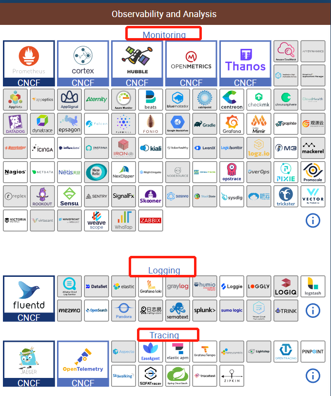

# 可观测性

Observability lets us understand a system from the outside, by letting us ask questions about that system without knowing its inner workings. 

我们先看看一个典型服务问题排查过程是怎样的：

- 通过各式各样预设报警发现异常（Metrics/Logs）
- 打开监控大盘查找异常现象，并通过查询找到异常模块（Metrics）
- 对异常模块以及关联日志进行查询分析，找到核心的报错信息（Logs）
- 通过详细的调用链数据定位到引起问题的代码（Tracing）

为了能够获得更好的可观测性或快速解决上述问题，Tracing、Metrics、Logs缺一不可。

与此同时，行业中已经有了丰富的开源及商业方案，其中包括：

- **Metric：**Zabbix、Nagios、Prometheus、InfluxDB、OpenFalcon、OpenCensus
- **Tracing：**Jaeger、Zipkin、SkyWalking、OpenTracing、OpenCensus
- **Logs：**ELK、Splunk、SumoLogic、Loki、Loggly。

有着五花八门的方案同时，各个方案也有着五花八门的协议格式/数据类型。不同的方案之间很难兼容/互通。与此同时，实际的业务场景中也会将各种方案混用，开发人员只能自己开发各类 Adapter 去兼容，

# Opentelemetry是什么？

作为 CNCF 的孵化项目，OpenTelemetry 由 OpenTracing 和 OpenCensus 项目合并而成，是一组产商无关的SDK、API 接口、工具，可用来收集、转换、发送数据到开源或者商业的可观测性后端。同时为众多开发人员带来 Metrics、Tracing、Logs 的统一标准，三者都有相同的元数据结构，可以轻松实现互相关联。

## 能做啥？

- 每种语言都有产商无关的库来支持自动和手动的测量
- 可支持多种部署方式，且与产商无关的二进制收集器
- 一个端到端实现产生，发射，收集，处理和导出telemetry数据
-  可通过配置将数据并行发送到多个目的地。  
- 开放标准语义约定，以确保供应商无关的数据收集  

## 不是啥？

OpenTelemetry 不是可观测性的后端，如Prometheus、Jaeger，不提供与可观测性相关的后端服务。可根据用户需求将可观测类数据导出到存储、查询、可视化等不同后端，如 Prometheus、Jaeger 、云厂商服务中。提供了可插拔的架构。

## Opentelemetry设计

